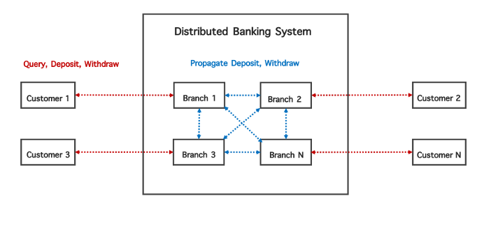
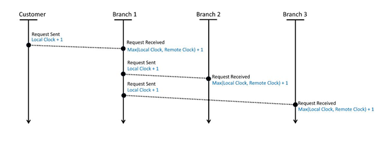
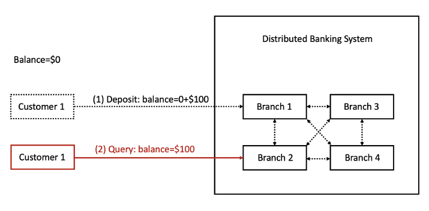

# Distributed Banking System Simulation

This repository contains the implementation of a simulated distributed banking system, developed as part of the coursework in Distributed Systems at Arizona State University. The project was built incrementally across three phases, each exploring and implementing core concepts in distributed systems: remote communication, logical time, and client-centric consistency.

## Project Motivation

Distributed systems form the foundation of modern large-scale applications, enabling reliability, scalability, and fault tolerance. However, understanding their intricacies requires more than theoretical study. This project provides a practical approach to learning distributed systems by simulating a multi-branch banking environment where clients interact with geographically dispersed branches.

The aim was to explore the behavior and correctness of such a system under different distributed system constraints such as asynchronous communication, causal ordering of events, and consistency models.

## Project Overview

### Phase I: Remote Communication with gRPC

The first phase establishes inter-process communication between customers and bank branches using **gRPC** in Python. The system supports basic banking operations such as querying balance, depositing, and withdrawing funds. To maintain state consistency across branches, transactions are propagated between branches using internal RPCs.

**Key components:**
- External RPCs: `Query`, `Deposit`, `Withdraw`
- Internal RPCs: `Propagate_Deposit`, `Propagate_Withdraw`
- Python multiprocessing to parallelize customer and branch processes

### Phase II: Logical Clocks and Causal Ordering

The second phase introduces **Lamport’s Logical Clocks** to track and enforce the causal ordering of events across distributed processes. This ensures that the order of operations reflects the logical sequence of actions across customers and branches.

**Enhancements:**
- Logical clock maintained per process (customer and branch)
- Clock values embedded in request messages
- Clock updates on send and receive operations as per Lamport’s algorithm
- Event logging with timestamps to verify causal consistency

### Phase III: Read-Your-Writes Consistency

The final phase implements a **read-your-writes** consistency model to improve user experience in replicated systems. A customer should always observe their latest updates, even when interacting with a different branch from where the update was issued.

**Mechanism:**
- Per-customer `event_tracker` to track successful write operations
- Per-branch tracker to store all propagated and local writes
- Branches block customer reads until the customer's writes have been fully propagated
- Synchronization check using matching `event_tracker` values before serving a read request

## Implementation Details

- The system is driven via a `main.py` controller which reads JSON input files and initiates customer and branch processes.
- Service definitions are implemented in Protocol Buffers (`.proto` file), and compiled using `grpcio-tools`.
- The system uses Python’s `multiprocessing` module for process creation and management.
- Logging modules are used extensively for debugging, validation, and verification of distributed behavior.

## Technologies Used

- Python 3.10+
- gRPC (`grpcio`, `grpcio-tools`)
- Protocol Buffers
- Multiprocessing (Python standard library)
- Ubuntu 22.04 (development environment)

## Testing

A series of test input files were used to simulate banking operations. Each test case validates a specific aspect of the system, such as:
- Balance consistency across branches
- Causal ordering of transactions
- Read-your-writes behavior under branch-switching scenarios

Sample input files are located in the `tests/` directory.

## References

1. A. S. Tanenbaum and M. Van Steen, *Distributed Systems: Principles and Paradigms*, 2nd ed., Pearson, 2007.  
2. gRPC, “Core concepts, architecture and lifecycle.” [https://grpc.io/docs/what-is-grpc/core-concepts/](https://grpc.io/docs/what-is-grpc/core-concepts/)  
3. L. Lamport, “Time, clocks, and the ordering of events in a distributed system,” *Communications of the ACM*, vol. 21, no. 7, pp. 558–565, 1978.  
4. W. Vogels, “Eventually consistent,” *Communications of the ACM*, vol. 52, no. 1, pp. 40–44, 2009.  
5. gRPC Python Quickstart. [https://grpc.io/docs/languages/python/quickstart/](https://grpc.io/docs/languages/python/quickstart/)  
6. Protocol Buffers Language Guide. [https://protobuf.dev/programming-guides/proto3/](https://protobuf.dev/programming-guides/proto3/)

## Author

**Tanmay Parulekar** 
- Note : This was developed as part of graduate coursework at Arizona State University.

[LinkedIn](https://www.linkedin.com/in/tanmay-parulekar) • [GitHub](https://github.com/tanmaymp)
